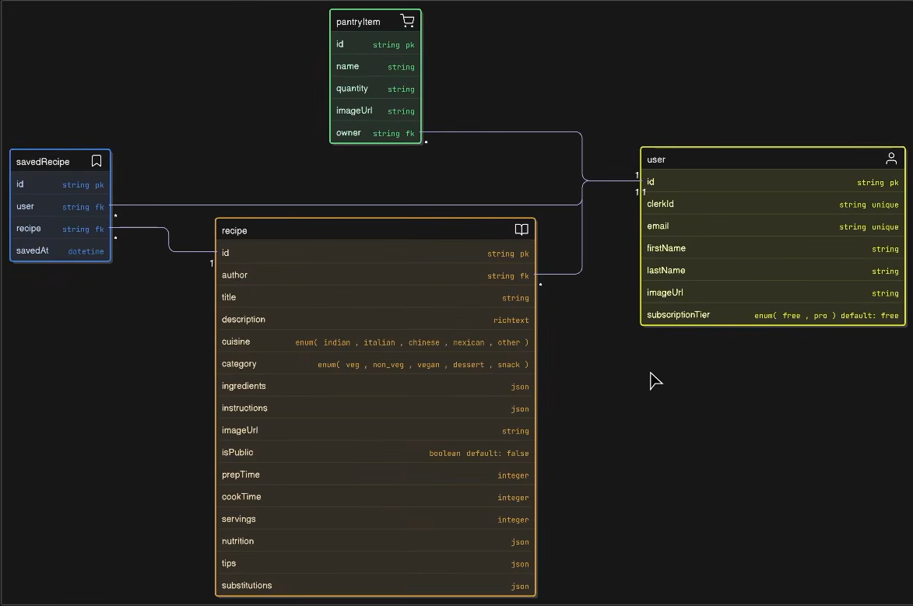

#  BiteBuddy

AI-powered pantry-to-recipe platform that helps users discover meals using ingredients they already have.

Scan pantry items with computer vision, generate structured recipe recommendations, browse recipes by cuisine or category, and build a personalized recipe collection.

🔗 **Live Demo :** https://bite-buddy-henna.vercel.app

## 1. Project Overview

BiteBuddy is a full-stack AI-powered recipe platform built with a decoupled architecture:

- `frontend/` is a Next.js App Router application that handles UI, authentication, server actions, and AI-driven workflows.
- `backend/` is a Strapi CMS backend that stores recipes, pantry items, and user recipe collections through structured content types.

The core experience is simple and practical: users scan pantry ingredients using AI vision, maintain pantry inventory, generate recipe recommendations, explore cuisines or meal categories, and save favorite recipes to their collection.

The frontend orchestrates product logic and user flows while Strapi persists structured entities such as recipes, pantry items, and saved relations. AI services provide ingredient recognition and recommendation intelligence.


## 2. Features

- AI pantry image scanning using Gemini Vision to extract visible ingredients.
- Pantry item CRUD management (add, update, delete, view).
- Recipe recommendation generation based on pantry ingredients.
- Browse recipes by cuisine (e.g., Indian, Italian, Chinese).
- Browse recipes by category (breakfast, lunch, dinner, snack, dessert).
- Save or remove recipes from a personal collection.
- Authentication and protected routes using Clerk.
- Subscription tier-based rate limiting using Arcjet.


## 3. Tech Stack

### Frontend

- Next.js (App Router)
- Server Actions
- Tailwind CSS + component library (shadcn-style UI primitives)
- Clerk Authentication
- Arcjet Rate Limiting
- Google Gemini AI

### Backend

- Strapi CMS
- REST API
- Content types for recipes, pantry items, and saved recipes

## 4. Architecture Overview

### High-level flow

```text
Client (Next.js UI)
  -> Server Actions / Route Handlers (frontend)
  -> Strapi REST API (backend)
  -> Strapi Database (persist and query)

AI-enhanced flows:
  -> Gemini Vision (ingredient extraction from pantry images)
  -> Gemini Text (recipe suggestions and structured recipe data)
```

### Request lifecycle examples

Pantry Scan
1. User uploads pantry/fridge image in frontend.
2. Server Action validates user and applies Arcjet tier limit.
3. Image is sent to Gemini Vision for ingredient extraction.
4. Ingredients are optionally saved to Strapi `pantry-items`.

Recipe Recommendations
1. Frontend loads current user pantry items from Strapi.
2. Ingredients are composed into a recommendation prompt.
3. Gemini returns structured suggestions.
4. Results are rendered and can be saved to collection.

Saved Recipes
1. Frontend creates/removes relations in Strapi `saved-recipes`.
2. User-specific collection is fetched with populated recipe data.

## 5. Data Model

BiteBuddy uses a relational content structure in Strapi to manage user pantry inventories, generated recipes, and saved collections.

- A **User** can own multiple pantry items.
- Recipes can be generated or curated and linked to users as authors.
- Users can bookmark recipes through a saved-recipe relation.
- Pantry items act as the primary signal for recipe recommendation workflows.

This schema illustrates how core entities are connected to support AI-driven recipe discovery and personalized collections.



## 6. Project Structure

```text
BiteBuddy/
       frontend/                # Next.js app (App Router)
              app/                   # Route groups: auth, dashboard, pantry, recipes
              actions/               # Server Actions (pantry, recipe, AI orchestration)
              components/            # Reusable UI blocks and feature components
              lib/                   # Arcjet config, user checks, utilities
              hooks/                 # Client hooks

       backend/                 # Strapi CMS app
              src/api/               # Strapi APIs and content-type modules
                     pantry-item/         # Pantry item schema, routes, controller, service
                     recipe/              # Recipe schema, routes, controller, service
                     saved-recipe/        # Saved recipe schema, routes, controller, service
              src/extensions/        # Extended Strapi user model
              config/                # Server, database, middleware, plugin config
              database/migrations/   # Migration folder
```

### Key frontend paths

- `frontend/actions/pantry.actions.js`: pantry image scan, pantry CRUD logic.
- `frontend/actions/recipe.actions.js` and `frontend/actions/recipe.ai.js`: recommendation and recipe generation logic.
- `frontend/lib/arcjet.js`: free/pro tier request limiting strategy.
- `frontend/proxy.js`: Arcjet + Clerk middleware flow for protected routes.

### Key backend paths

- `backend/src/api/recipe/content-types/recipe/schema.json`
- `backend/src/api/pantry-item/content-types/pantry-item/schema.json`
- `backend/src/api/saved-recipe/content-types/saved-recipe/schema.json`
- `backend/src/extensions/users-permissions/content-types/user/schema.json`

## 7. Environment Variables Setup

Create local environment files in both apps before running development servers.

### Frontend env variables (`frontend/.env`)

- `NEXT_PUBLIC_CLERK_PUBLISHABLE_KEY`: Clerk public key for client SDK.
- `CLERK_SECRET_KEY`: Clerk secret key for server-side auth.
- `NEXT_PUBLIC_CLERK_SIGN_IN_URL`: sign-in route path.
- `NEXT_PUBLIC_CLERK_SIGN_UP_URL`: sign-up route path.
- `ARCJET_KEY`: Arcjet project key for protection and rate limits.
- `NEXT_PUBLIC_STRAPI_URL`: base URL for Strapi API (typically `http://localhost:1337`).
- `STRAPI_API_TOKEN`: Strapi API token used by server actions.
- `GEMINI_API_KEY`: Google Gemini API key.
- `UNPLASH_ACCESS_KEY`: Unsplash key for recipe image lookup (optional but recommended).

### Backend env variables (`backend/.env`)

Required for Strapi startup:

- `HOST`
- `PORT`
- `APP_KEYS`
- `API_TOKEN_SALT`
- `ADMIN_JWT_SECRET`
- `TRANSFER_TOKEN_SALT`
- `JWT_SECRET`
- `ENCRYPTION_KEY`

Common database-related variables (depending on selected client):

- `DATABASE_CLIENT`
- `DATABASE_URL`
- `DATABASE_HOST`
- `DATABASE_PORT`
- `DATABASE_NAME`
- `DATABASE_USERNAME`
- `DATABASE_PASSWORD`
- `DATABASE_SSL`
- `DATABASE_SCHEMA`

Tip: Start from `backend/.env.example` and extend as needed for your database choice.

## 8. Local Development Setup

### Prerequisites

- Node.js 20+
- npm

### Step 1: Install backend dependencies

```bash
cd backend
npm install
```

### Step 2: Configure backend env and run Strapi

1. Create/update `backend/.env`.
2. Add required Strapi secrets and database configuration.
3. Run Strapi in development mode:

```bash
npm run develop
```

Backend runs at `http://localhost:1337` by default.

### Step 3: Install frontend dependencies

Open a new terminal:

```bash
cd frontend
npm install
```

### Step 4: Configure frontend env and run Next.js

1. Create/update `frontend/.env`.
2. Add Clerk, Arcjet, Strapi, Gemini (and optional Unsplash) keys.
3. Run frontend dev server:

```bash
npm run dev
```

Frontend runs at `http://localhost:3000` by default.

## 9. Future Improvements

- AI optimization: Improve prompt strategy, schema validation, and fallback handling for malformed AI outputs.
- Caching strategy: Add server-side caching for repeated recommendation patterns and hot recipe queries.
- Performance: Introduce query optimizations and response shaping for Strapi endpoints with heavy population.
- UX enhancements: Better scan feedback loops, confidence visualization, and bulk pantry edit workflows.
- Recommendation quality: Add personalization signals (history, saved recipes, dietary preferences, seasonality).
- Reliability: Expand automated tests for middleware, server actions, and API integration contracts.

